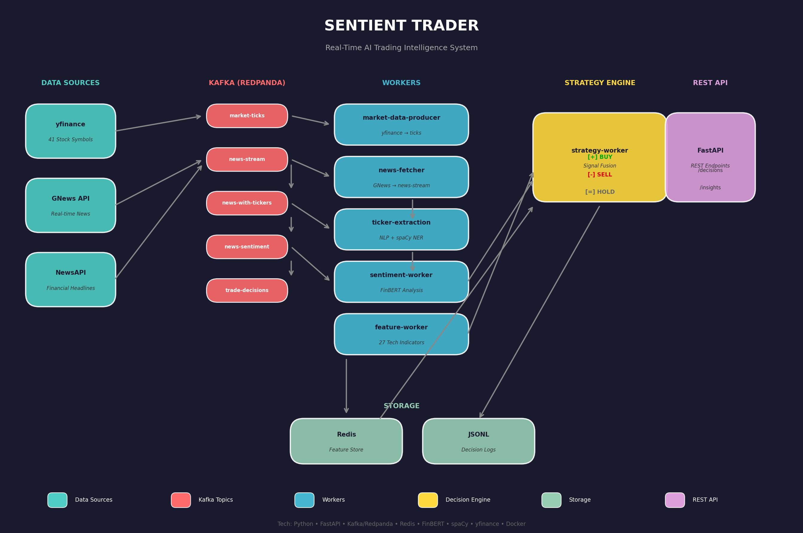

<div align="center">

# 🤖 Sentient-Trader

### AI-Powered Real-Time Trading Intelligence Platform

[](https://www.python.org/downloads/)
[](https://www.docker.com/)
[](https://redpanda.com/)
[](https://fastapi.tiangolo.com/)
[](https://opensource.org/licenses/MIT)

_Transform financial news into actionable trading signals using AI-powered sentiment analysis and real-time market data_

[Features](#-features) • [Architecture](#-system-architecture) • [Quick Start](#-quick-start) • [API](#-api-reference) • [Contributing](#-contributing)

</div>

---

## 📖 Overview

**Sentient-Trader** is a production-ready, real-time trading intelligence platform that combines cutting-edge NLP with market data processing to generate actionable trading signals. The system leverages:

- 🧠 **FinBERT** - Financial domain-specific BERT model for sentiment analysis
- 📊 **27 Technical Indicators** - RSI, MACD, Bollinger Bands, and more
- 🔄 **Distributed Streaming** - Kafka (Redpanda) for real-time event processing
- 💾 **Redis Feature Store** - Low-latency feature retrieval
- 🌐 **REST API** - FastAPI-based endpoints for system interaction

---

## 🏗️ System Architecture

<div align="center">



_Complete system architecture showing data flow from news ingestion to trade signals_

</div>

### 🔄 Data Flow Pipeline

```
┌─────────────────────────────────────────────────────────────────────────────────────────┐
│                              SENTIENT-TRADER PLATFORM                                    │
├─────────────────────────────────────────────────────────────────────────────────────────┤
│                                                                                          │
│   📰 DATA SOURCES                  ⚙️ PROCESSING WORKERS                  🎯 OUTPUT      │
│   ─────────────────               ─────────────────────                 ───────────     │
│                                                                                          │
│   ┌─────────────┐                 ┌─────────────────────┐              ┌───────────┐   │
│   │ Google News │ ──┐             │  Ticker Extraction  │              │   REST    │   │
│   └─────────────┘   │             │  • NLP-based        │              │    API    │   │
│                     │             │  • Confidence Score │              └───────────┘   │
│   ┌─────────────┐   │   Kafka     └─────────┬───────────┘                    ▲         │
│   │  NewsAPI    │ ──┼──────────────────────►│                                │         │
│   └─────────────┘   │  (news-stream)        ▼                                │         │
│                     │             ┌─────────────────────┐              ┌───────────┐   │
│   ┌─────────────┐   │             │ Sentiment Analysis  │              │  Trading  │   │
│   │  yfinance   │ ──┘             │  • FinBERT Model    │              │  Signals  │   │
│   │ (41 stocks) │                 │  • Positive/Neg/Neu │              └───────────┘   │
│   └─────────────┘                 └─────────┬───────────┘                    ▲         │
│         │                                   │                                │         │
│         │   Kafka                           ▼                                │         │
│         │  (market-ticks)        ┌─────────────────────┐              ┌───────────┐   │
│         └───────────────────────►│   Feature Worker    │──────────────│  Strategy │   │
│                                  │  • 27 Indicators    │   Redis      │   Worker  │   │
│                                  │  • RSI, MACD, EMA   │              └───────────┘   │
│                                  └─────────────────────┘                              │
│                                                                                          │
└─────────────────────────────────────────────────────────────────────────────────────────┘
```

### 📊 Kafka Topics

| Topic               | Description                     | Producer         | Consumer         |
| ------------------- | ------------------------------- | ---------------- | ---------------- |
| `news-stream`       | Raw news articles               | News Fetcher     | Ticker Worker    |
| `news-with-tickers` | Articles with extracted tickers | Ticker Worker    | Sentiment Worker |
| `news-sentiment`    | Articles with sentiment scores  | Sentiment Worker | Strategy Worker  |
| `market-ticks`      | Real-time stock prices          | Market Producer  | Feature Worker   |
| `trade-decisions`   | Generated trade signals         | Strategy Worker  | API/Consumers    |

---

## 🚀 Features

| Feature                         | Description                                                   |
| ------------------------------- | ------------------------------------------------------------- |
| 📰 **Real-time News Ingestion** | Multi-source news aggregation from Google News & NewsAPI      |
| 🏷️ **Ticker Extraction**        | NLP-based stock ticker identification with confidence scoring |
| 🎭 **Sentiment Analysis**       | FinBERT-powered financial sentiment classification            |
| 📊 **Technical Indicators**     | 27 indicators (RSI, MACD, SMA, EMA, Bollinger Bands, etc.)    |
| 🤖 **Trading Signals**          | Multi-factor strategy combining sentiment + technicals        |
| 📈 **Backtesting**              | Historical strategy evaluation with PnL tracking              |
| 🌐 **REST API**                 | FastAPI endpoints for real-time data access                   |
| 🐳 **Docker Ready**             | 12-service Docker Compose deployment                          |
| ☸️ **Kubernetes**               | Production-ready K8s manifests included                       |

---

## 📁 Project Structure

```
Sentient-Trader/
│
├── 📦 docker-compose.yml          # 12-service orchestration
├── 🐳 Dockerfile                  # Container build configuration
├── 📋 requirements.txt            # Python dependencies
├── 🚀 run_full_pipeline.py        # Full system launcher
│
├── 📊 data/                       # Data & configurations
│   ├── company_ticker_map.json    # Company-to-ticker mapping (500+ companies)
│   ├── fetch_real_osint.py        # OSINT data fetcher
│   ├── fetch_real_stock.py        # Stock data fetcher
│   ├── market_ticks.jsonl         # Sample market tick data
│   ├── osint_events.jsonl         # Sample OSINT events
│   └── features/                  # Cached feature files
│
├── 📥 ingest/                     # News Ingestion Adapters
│   ├── google_news_adapter/
│   │   └── fetch_google_news.py   # GNews API integration
│   └── news_api_adapter/
│       └── fetch_news_api.py      # NewsAPI integration
│
├── 🔍 enrich/                     # Data Enrichment
│   ├── sentiment/
│   │   ├── sentiment_analysis.py  # FinBERT sentiment model
│   │   └── worker.py              # Kafka sentiment worker
│   └── ticker_extraction/
│       ├── extractor.py           # NLP ticker extraction
│       ├── worker.py              # Kafka ticker worker
│       ├── confidence.py          # Confidence scoring
│       ├── band_analytics.py      # Band analysis utilities
│       ├── outcome_tracker.py     # Trade outcome tracking
│       └── api.py                 # Extraction API endpoints
│
├── 💾 feature_store/              # Feature Engineering
│   ├── feature_store.py           # Redis feature storage
│   ├── feature_worker.py          # Technical indicator calculator
│   └── api.py                     # Feature API endpoints
│
├── 🧠 tools/                      # Processing Workers
│   ├── strategy_worker.py         # Trade decision engine
│   ├── market_data_producer.py    # yfinance data producer
│   ├── produce_tick.py            # Tick data producer
│   ├── send_test_news.py          # Test news publisher
│   └── send_test_articles.py      # Test article publisher
│
├── 🌐 serve/                      # API Layer
│   └── api.py                     # FastAPI REST endpoints
│
├── 📈 backtester/                 # Backtesting Engine
│   └── run_backtest.py            # Historical strategy evaluation
│
├── 🎯 evaluation/                 # Strategy Evaluation
│   ├── metrics.py                 # Performance metrics
│   └── outcome_labeler.py         # Trade outcome labeling
│
├── 🤖 model/                      # Machine Learning
│   └── train.py                   # Model training scripts
│
├── 🧪 test/                       # Test Suite
│   └── unit/
│       ├── test_sentiment.py      # Sentiment tests
│       └── test_strategy.py       # Strategy tests
│
├── ☸️ infra/k8s/                  # Kubernetes Configs
│   ├── deployment.yaml            # Deployment manifest
│   ├── service.yaml               # Service manifest
│   ├── prometheus-config.yaml     # Prometheus configuration
│   └── grafana.yaml               # Grafana dashboard
│
├── 🛠️ utils/                      # Utilities
│   └── logging_config.py          # Logging configuration
│
├── 📁 results/                    # Output & Results
│   ├── backtest_run.json          # Backtest results
│   ├── ledger_*.csv               # Trade ledgers
│   └── trades_summary_*.csv       # Trade summaries
│
├── 📚 docs/                       # Documentation
│   ├── architecture.png           # System architecture diagram
│   └── architecture.svg           # SVG version
│
└── 📓 notebooks/                  # Jupyter Notebooks
    └── demo.md                    # Demo documentation
```

---

## 🔧 Technical Indicators

The Feature Worker computes **27 technical indicators** in real-time:

| Category               | Indicators                                                           |
| ---------------------- | -------------------------------------------------------------------- |
| **Trend**              | SMA (5, 10, 20, 50), EMA (12, 26), MACD, Signal Line, MACD Histogram |
| **Momentum**           | RSI (14), Stochastic %K, Stochastic %D, ROC, Momentum                |
| **Volatility**         | Bollinger Bands (Upper, Middle, Lower), ATR, Standard Deviation      |
| **Volume**             | OBV, Volume SMA, VWAP                                                |
| **Support/Resistance** | Pivot Points, Fibonacci Levels                                       |

---

## 🐳 Quick Start

### Prerequisites

- Docker & Docker Compose
- Python 3.11+ (for local development)
- 8GB+ RAM recommended

### 1️⃣ Clone & Setup

```bash
# Clone the repository
git clone https://github.com/vikasp07/Sentient-Trader.git
cd Sentient-Trader

# Copy environment template
cp .env.example .env
```

### 2️⃣ Configure Environment

Edit `.env` with your API keys:

```env
# News APIs
GNEWS_API_KEY=your_gnews_api_key
NEWS_API_KEY=your_newsapi_key

# Kafka (Redpanda)
KAFKA_BOOTSTRAP_SERVERS=redpanda:9092

# Redis
REDIS_HOST=redis
REDIS_PORT=6379

# API Settings
API_HOST=0.0.0.0
API_PORT=8000
```

### 3️⃣ Launch Services

```bash
# Start all 12 services
docker-compose up -d

# View logs
docker-compose logs -f

# Check service health
docker-compose ps
```

### 4️⃣ Access the System

| Service          | URL                        | Description           |
| ---------------- | -------------------------- | --------------------- |
| REST API         | http://localhost:8000      | Main API endpoint     |
| API Docs         | http://localhost:8000/docs | Swagger documentation |
| Redpanda Console | http://localhost:8080      | Kafka topic browser   |
| MinIO Console    | http://localhost:9001      | Object storage        |

---

## 🌐 API Reference

### Health Check

```bash
GET /health
```

**Response:**

```json
{
  "status": "healthy",
  "timestamp": "2024-12-25T10:30:00Z"
}
```

### Get Features for Symbol

```bash
GET /features/{symbol}
```

**Example:**

```bash
curl http://localhost:8000/features/AAPL
```

**Response:**

```json
{
  "symbol": "AAPL",
  "features": {
    "rsi_14": 65.5,
    "macd": 2.34,
    "sma_20": 178.5,
    "sentiment_score": 0.85
  },
  "timestamp": "2024-12-25T10:30:00Z"
}
```

### Get Trade Decisions

```bash
GET /trades
```

**Response:**

```json
{
  "trades": [
    {
      "symbol": "AAPL",
      "action": "BUY",
      "confidence": 0.87,
      "sentiment": "positive",
      "price": 178.5,
      "timestamp": "2024-12-25T10:30:00Z"
    }
  ]
}
```

### Submit News Article

```bash
POST /news
Content-Type: application/json

{
  "title": "Apple announces record Q4 earnings",
  "content": "Apple Inc reported...",
  "source": "Reuters"
}
```

---

## 🐋 Docker Services

| Service                    | Port       | Description                |
| -------------------------- | ---------- | -------------------------- |
| `redpanda`                 | 9092, 8080 | Kafka-compatible streaming |
| `redis`                    | 6379       | Feature store              |
| `minio`                    | 9000, 9001 | Object storage             |
| `api`                      | 8000       | Main REST API              |
| `sentiment-api`            | 8001       | Sentiment service          |
| `sentiment-worker`         | -          | Sentiment processing       |
| `ticker-extraction-worker` | -          | Ticker extraction          |
| `feature-worker`           | -          | Technical indicators       |
| `feature-api`              | 8002       | Feature API                |
| `strategy-worker`          | -          | Trade decisions            |
| `news-fetcher`             | -          | News ingestion             |
| `market-data-producer`     | -          | Price data                 |

---

## 🧪 Testing

```bash
# Run all tests
pytest test/ -v

# Run specific test file
pytest test/unit/test_sentiment.py -v

# Run with coverage
pytest test/ --cov=. --cov-report=html
```

---

## 📈 Backtesting

Run historical backtests on your strategy:

```bash
# Run backtest with sample data
python backtester/run_backtest.py \
  --data data/market_ticks.jsonl \
  --osint data/osint_events.jsonl \
  --output results/backtest_run.json
```

---

## ☸️ Kubernetes Deployment

Deploy to Kubernetes cluster:

```bash
# Apply configurations
kubectl apply -f infra/k8s/

# Check deployment status
kubectl get pods -l app=sentient-trader

# Access logs
kubectl logs -f deployment/sentient-trader
```

---

## 🔒 Trading Modes

The Strategy Worker supports three decision modes:

| Mode          | Description                     | Requirements                |
| ------------- | ------------------------------- | --------------------------- |
| **News-Only** | Trade on strong sentiment alone | Sentiment ≥ 0.70            |
| **Partial**   | Trade with basic features       | Sentiment + some indicators |
| **Full**      | Complete multi-factor analysis  | All features + sentiment    |

---

## 📊 Technical Stack

<div align="center">

| Layer             | Technology                 |
| ----------------- | -------------------------- |
| **Language**      | Python 3.11+               |
| **NLP Model**     | FinBERT (ProsusAI/finbert) |
| **Streaming**     | Apache Kafka (Redpanda)    |
| **Cache**         | Redis                      |
| **Storage**       | MinIO (S3-compatible)      |
| **API**           | FastAPI + Uvicorn          |
| **Market Data**   | yfinance                   |
| **Containers**    | Docker + Docker Compose    |
| **Orchestration** | Kubernetes                 |
| **Monitoring**    | Prometheus + Grafana       |

</div>

---

## 📄 License

This project is licensed under the MIT License - see the [LICENSE](LICENSE) file for details.

---

## 🤝 Contributing

Contributions are welcome! Please feel free to submit a Pull Request.

1. Fork the repository
2. Create your feature branch (`git checkout -b feature/AmazingFeature`)
3. Commit your changes (`git commit -m 'Add some AmazingFeature'`)
4. Push to the branch (`git push origin feature/AmazingFeature`)
5. Open a Pull Request

---

## 📧 Contact

**Vikas P** - [@vikasp07](https://github.com/vikasp07)

Project Link: [https://github.com/vikasp07/Sentient-Trader](https://github.com/vikasp07/Sentient-Trader)

---

<div align="center">

**⭐ Star this repository if you find it helpful!**

Made with ❤️ by [Vikas P](https://github.com/vikasp07)

</div>
